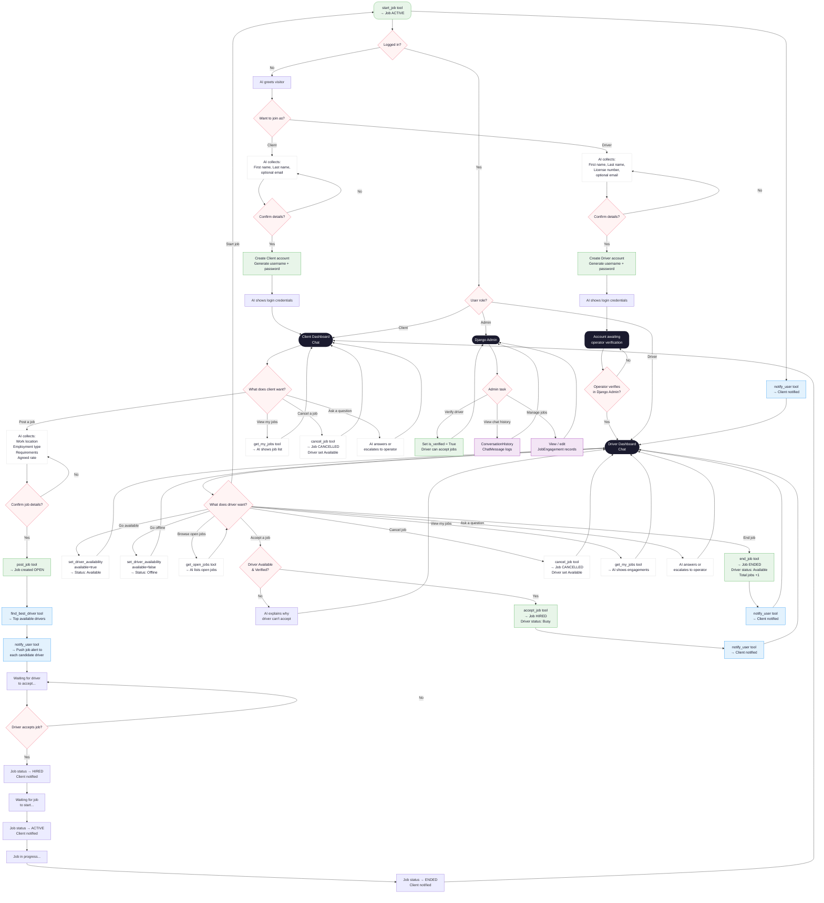

# Drivas — Activity Diagram



---

## Flow Summary

| Actor | Key Activities |
|-------|---------------|
| **Anonymous visitor** | Chat → Choose role → Register (AI-guided) → Receive credentials |
| **Client** | Post job → AI matches & notifies drivers → Track job status → Cancel if needed |
| **Driver** | Set availability → Browse jobs → Accept → Start → End |
| **AI Agent** | Onboarding, job posting, driver matching, notifications, customer support |
| **Operator (Admin)** | Verify drivers, view logs, manage jobs via Django Admin |

## Job Status Lifecycle

```
OPEN → HIRED → ACTIVE → ENDED
         ↓        ↓
      CANCELLED  CANCELLED
```
